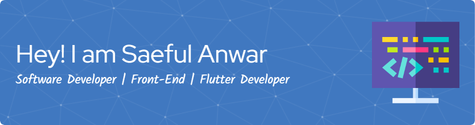

<!-- <h1 align="center">Hi, I'm Saeful Anwar 👋</h1>

Software Developer | Front-End & Flutter Specialist | Passionate About UI/UX
 -->

---

🎯 **About Me**

- 👨‍🎓 Fresh graduate from **Telkom University** majoring in Software Engineering (2020–2024)
- 🧠 Passionate about **Mobile Development**, especially with **Flutter**
- 🔧 Experienced in building mobile and web apps using **Flutter**, **Firebase**, **REST API**, and **Node.js**
- 🎨 Enthusiastic about **UI/UX Design**, participated in UI/UX competition (Java Business Competition 2022)
- 🌍 Currently open for freelance or full-time opportunities
- 📍 Based in Karawang, Indonesia

---

### 🧰 Tech Stack

  
  
  
  
  
  
  
  
  
  

  
  
  

  
  
  
  

---

### 🚀 Highlighted Projects

- **📱 Beali** — Interactive learning app for Balinese script with quizzes  
  _Flutter + Firebase_

- **🛠️ Montirku** — Workshop finder app with Google Maps integration  
  _Flutter + GCP Maps + Golang Backend_

- **💰 Finteen** — Personal finance tracker with login and auth  
  _Flutter + Firebase_

- **📚 Unit 3C** — Online course platform with clean, user-friendly UI  
  _Flutter_

- **🧑‍💻 LMS Web Platform (On Going)** — Subscription-based learning management system  
  _Next.js + Node.js + PostgreSQL_

---

### 📊 GitHub Stats

  
   
  
   
  

---

### 📫 Let's Connect

- 📧 Email: saefulanwar7721@email.com
- 🔗 GitHub: [github.com/saefulanwar7721](https://github.com/saefulanwar7721)
<!-- - 💼 LinkedIn: [linkedin.com/in/your-link](#) _(optional, masukin kalau ada)_ -->

---

_“Keep learning, keep building.”_

<!--
**saefulanwar7721/Saefulanwar7721** is a ✨ _special_ ✨ repository because its `README.md` (this file) appears on your GitHub profile.

Here are some ideas to get you started:

- 🔭 I’m currently working on ...
- 🌱 I’m currently learning ...
- 👯 I’m looking to collaborate on ...
- 🤔 I’m looking for help with ...
- 💬 Ask me about ...
- 📫 How to reach me: ...
- 😄 Pronouns: ...
- ⚡ Fun fact: ...
-->
